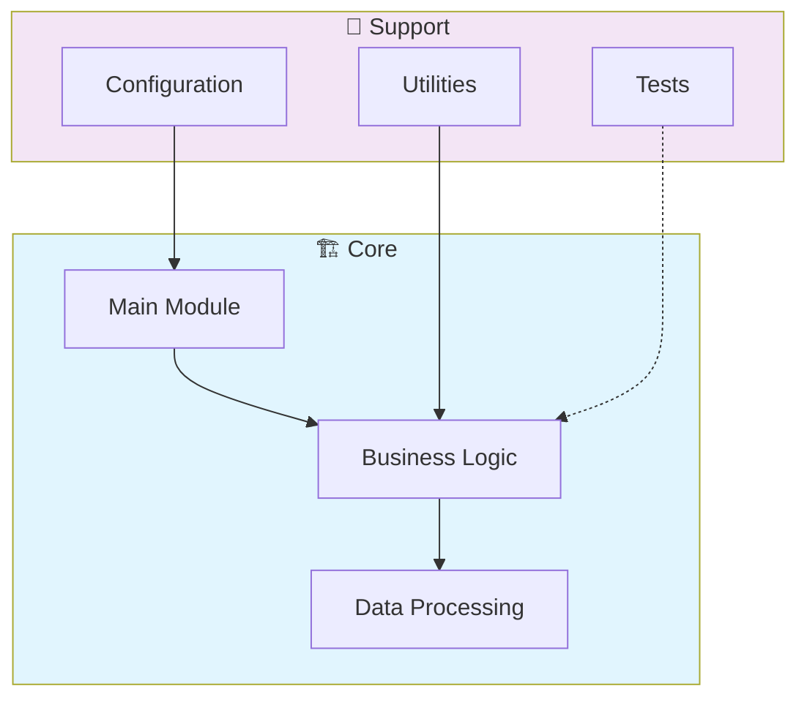

# 🚀 Javascript Fullstack Capstone Project

> Coursera - IBM Fullstack

[](https://img.shields.io/badge/)
[](LICENSE)

[English](#english) | [Português](#português)

---

## English

### 🎯 Overview

**Javascript Fullstack Capstone Project** is a production-grade JavaScript application complemented by CSS, HTML that showcases modern software engineering practices including clean architecture, comprehensive testing, containerized deployment, and CI/CD readiness.

The codebase comprises **2,327 lines** of source code organized across **32 modules**, following industry best practices for maintainability, scalability, and code quality.

### ✨ Key Features

- **📐 Clean Architecture**: Modular design with clear separation of concerns
- **🧪 Test Coverage**: Unit and integration tests for reliability
- **📚 Documentation**: Comprehensive inline documentation and examples
- **🔧 Configuration**: Environment-based configuration management

### 🏗️ Architecture



### 🚀 Quick Start

#### Prerequisites

- Node.js 20+
- npm or yarn

#### Installation

```bash
# Clone the repository
git clone https://github.com/galafis/Javascript-Fullstack-Capstone-Project.git
cd Javascript-Fullstack-Capstone-Project

# Install dependencies
npm install
```

#### Running

```bash
# Development mode
npm run dev

# Production build
npm run build
npm start
```

### 🐳 Docker

```bash
# Start all services
docker-compose up -d

# View logs
docker-compose logs -f

# Stop all services
docker-compose down

# Rebuild after changes
docker-compose up -d --build
```

### 📁 Project Structure

```
Javascript-Fullstack-Capstone-Project/
├── giftlink-backend/
│   ├── models/        # Data models
│   │   └── db.js
│   ├── routes/
│   │   ├── authRoutes.js
│   │   ├── giftRoutes.js
│   │   └── searchRoutes.js
│   ├── sentiment/
│   │   └── index.js
│   ├── util/
│   │   └── import-mongo/
│   ├── Dockerfile
│   ├── app.js
│   ├── deployment.yml
│   ├── logger.js
│   ├── package-lock.json
│   └── package.json
├── giftlink-frontend/
│   ├── public/
│   │   ├── images/
│   │   ├── static/
│   │   ├── manifest.json
│   │   └── robots.txt
│   ├── src/          # Source code
│   │   ├── components/
│   │   ├── context/
│   │   ├── App.js
│   │   ├── config.js
│   │   └── index.js
│   ├── Dockerfile
│   ├── package-lock.json
│   └── package.json
├── giftwebsite/
│   ├── Dockerfile
│   ├── index.js
│   ├── package-lock.json
│   └── package.json
├── github_issues/
│   ├── issue_1_profile.md
│   ├── issue_2_add_gift.md
│   ├── issue_3_edit_gift.md
│   ├── issue_4_delete_gift.md
│   ├── issue_5_improve_search.md
│   ├── issue_6_sentiment_analysis.md
│   ├── issue_7_refactor_auth.md
│   └── issue_8_frontend_styling.md
├── sentiment/
│   ├── index.js
│   ├── logger.js
│   ├── package-lock.json
│   └── package.json
├── tests/         # Test suite
│   └── main.test.js
├── LICENSE
├── README.md
├── deploymongo.yml
├── docker-compose.yml
└── todo.md
```

### 🛠️ Tech Stack

| Technology | Description | Role |
|------------|-------------|------|
| **JavaScript** | Core Language | Primary |
| CSS | 8 files | Supporting |
| HTML | 2 files | Supporting |

### 🚀 Deployment

#### Cloud Deployment Options

The application is containerized and ready for deployment on:

| Platform | Service | Notes |
|----------|---------|-------|
| **AWS** | ECS, EKS, EC2 | Full container support |
| **Google Cloud** | Cloud Run, GKE | Serverless option available |
| **Azure** | Container Instances, AKS | Enterprise integration |
| **DigitalOcean** | App Platform, Droplets | Cost-effective option |

```bash
# Production build
docker build -t Javascript-Fullstack-Capstone-Project:latest .

# Tag for registry
docker tag Javascript-Fullstack-Capstone-Project:latest registry.example.com/Javascript-Fullstack-Capstone-Project:latest

# Push to registry
docker push registry.example.com/Javascript-Fullstack-Capstone-Project:latest
```

### 🤝 Contributing

Contributions are welcome! Please feel free to submit a Pull Request. For major changes, please open an issue first to discuss what you would like to change.

1. Fork the project
2. Create your feature branch (`git checkout -b feature/AmazingFeature`)
3. Commit your changes (`git commit -m 'Add some AmazingFeature'`)
4. Push to the branch (`git push origin feature/AmazingFeature`)
5. Open a Pull Request

### 📄 License

This project is licensed under the MIT License - see the [LICENSE](LICENSE) file for details.

### 👤 Author

**Gabriel Demetrios Lafis**
- GitHub: [@galafis](https://github.com/galafis)
- LinkedIn: [Gabriel Demetrios Lafis](https://linkedin.com/in/gabriel-demetrios-lafis)

---

## Português

### 🎯 Visão Geral

**Javascript Fullstack Capstone Project** é uma aplicação JavaScript de nível profissional, complementada por CSS, HTML que demonstra práticas modernas de engenharia de software, incluindo arquitetura limpa, testes abrangentes, implantação containerizada e prontidão para CI/CD.

A base de código compreende **2,327 linhas** de código-fonte organizadas em **32 módulos**, seguindo as melhores práticas do setor para manutenibilidade, escalabilidade e qualidade de código.

### ✨ Funcionalidades Principais

- **📐 Clean Architecture**: Modular design with clear separation of concerns
- **🧪 Test Coverage**: Unit and integration tests for reliability
- **📚 Documentation**: Comprehensive inline documentation and examples
- **🔧 Configuration**: Environment-based configuration management

### 🏗️ Arquitetura


### 🚀 Início Rápido

#### Prerequisites

- Node.js 20+
- npm or yarn

#### Installation

```bash
# Clone the repository
git clone https://github.com/galafis/Javascript-Fullstack-Capstone-Project.git
cd Javascript-Fullstack-Capstone-Project

# Install dependencies
npm install
```

#### Running

```bash
# Development mode
npm run dev

# Production build
npm run build
npm start
```

### 🐳 Docker

```bash
# Start all services
docker-compose up -d

# View logs
docker-compose logs -f

# Stop all services
docker-compose down

# Rebuild after changes
docker-compose up -d --build
```

### 📁 Estrutura do Projeto

```
Javascript-Fullstack-Capstone-Project/
├── giftlink-backend/
│   ├── models/        # Data models
│   │   └── db.js
│   ├── routes/
│   │   ├── authRoutes.js
│   │   ├── giftRoutes.js
│   │   └── searchRoutes.js
│   ├── sentiment/
│   │   └── index.js
│   ├── util/
│   │   └── import-mongo/
│   ├── Dockerfile
│   ├── app.js
│   ├── deployment.yml
│   ├── logger.js
│   ├── package-lock.json
│   └── package.json
├── giftlink-frontend/
│   ├── public/
│   │   ├── images/
│   │   ├── static/
│   │   ├── manifest.json
│   │   └── robots.txt
│   ├── src/          # Source code
│   │   ├── components/
│   │   ├── context/
│   │   ├── App.js
│   │   ├── config.js
│   │   └── index.js
│   ├── Dockerfile
│   ├── package-lock.json
│   └── package.json
├── giftwebsite/
│   ├── Dockerfile
│   ├── index.js
│   ├── package-lock.json
│   └── package.json
├── github_issues/
│   ├── issue_1_profile.md
│   ├── issue_2_add_gift.md
│   ├── issue_3_edit_gift.md
│   ├── issue_4_delete_gift.md
│   ├── issue_5_improve_search.md
│   ├── issue_6_sentiment_analysis.md
│   ├── issue_7_refactor_auth.md
│   └── issue_8_frontend_styling.md
├── sentiment/
│   ├── index.js
│   ├── logger.js
│   ├── package-lock.json
│   └── package.json
├── tests/         # Test suite
│   └── main.test.js
├── LICENSE
├── README.md
├── deploymongo.yml
├── docker-compose.yml
└── todo.md
```

### 🛠️ Stack Tecnológica

| Tecnologia | Descrição | Papel |
|------------|-----------|-------|
| **JavaScript** | Core Language | Primary |
| CSS | 8 files | Supporting |
| HTML | 2 files | Supporting |

### 🚀 Deployment

#### Cloud Deployment Options

The application is containerized and ready for deployment on:

| Platform | Service | Notes |
|----------|---------|-------|
| **AWS** | ECS, EKS, EC2 | Full container support |
| **Google Cloud** | Cloud Run, GKE | Serverless option available |
| **Azure** | Container Instances, AKS | Enterprise integration |
| **DigitalOcean** | App Platform, Droplets | Cost-effective option |

```bash
# Production build
docker build -t Javascript-Fullstack-Capstone-Project:latest .

# Tag for registry
docker tag Javascript-Fullstack-Capstone-Project:latest registry.example.com/Javascript-Fullstack-Capstone-Project:latest

# Push to registry
docker push registry.example.com/Javascript-Fullstack-Capstone-Project:latest
```

### 🤝 Contribuindo

Contribuições são bem-vindas! Sinta-se à vontade para enviar um Pull Request.

### 📄 Licença

Este projeto está licenciado sob a Licença MIT - veja o arquivo [LICENSE](LICENSE) para detalhes.

### 👤 Autor

**Gabriel Demetrios Lafis**
- GitHub: [@galafis](https://github.com/galafis)
- LinkedIn: [Gabriel Demetrios Lafis](https://linkedin.com/in/gabriel-demetrios-lafis)
